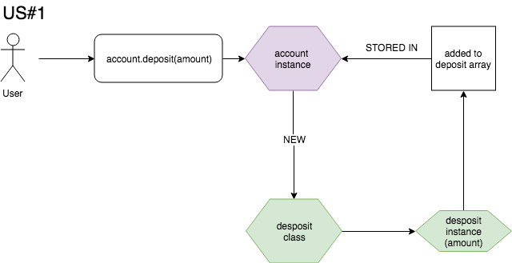

## Modelling

```
User Story 1:
As a bank customer
So that I can keep my money safe
I would like to deposit money into my account
```


```
User Story 2:
As a bank customer
So that I can see how much money I have
I would like to see my balance printed on the screen
```


```
User Story 3:
As a bank customer
So that I can spend money on stuff
I would like to be able to withdraw my money
```


```
User Story 4:
As a bank customer
So that I can track my saving and spending over time
I would like to see an account statement, with withdrawals, deposits, timestamps and balance adjustments, printed on the screen.
```

rough domain:

deposit class
ATTRIBUTES:
- credit amount
- date
FUNCTIONS:
- read attributes

withdrawal class
ATTRIBUTES:
- debit amount
- date
FUNCTIONS:
- read attributes

statement_line_printer class
ATTRIBUTES:
- row string format
FUNCTIONS:
- format withdrawal or deposit as row string

account class
ATTRIBUTES
- [deposits]
- [withdrawals]
FUNCTIONS:
- create deposit instance [deposit class]
- create withdrawal instance [withdrawal class]
- create combined array of withdrawal and deposit instances
- time order combined withdrawal/deposit array
- calculate balance from withdrawal/deposit
- calculate balance history (as separate array) from withdrawal/deposit array
- combine deposit/withdrawal array with balance array
- print combined deposit/withdrawal/balance array as bank statement [statement_line_printer class]


## Specification

### Requirements

* You should be able to interact with your code via a REPL like IRB or the JavaScript console.  (You don't need to implement a command line interface that takes input from STDIN.)
* Deposits, withdrawal.
* Account statement (date, amount, balance) printing.
* Data can be kept in memory (it doesn't need to be stored to a database or anything).

### Acceptance criteria

**Given** a client makes a deposit of 1000 on 10-01-2012  
**And** a deposit of 2000 on 13-01-2012  
**And** a withdrawal of 500 on 14-01-2012  
**When** she prints her bank statement  
**Then** she would see

```
date || credit || debit || balance
14/01/2012 || || 500.00 || 2500.00
13/01/2012 || 2000.00 || || 3000.00
10/01/2012 || 1000.00 || || 1000.00
```
