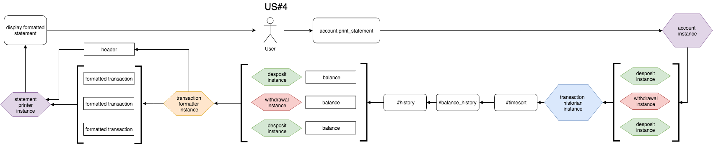

# Introduction

A simple simulation of a bank account, allowing deposit, withdrawal, balance
checking, and statement display.

### Tech

Written in Python 3.6.5. All packages used are included as default in the main
python install. Tests were written in the default python testing library,
unittest.

### Content

| dir: | contents: |
|--|--|
| root | class logic ([*].py), README and README images |
| test | class tests (test_[*].py) |

# Instructions For Use

## Getting Started

1. Install Python 3 if not already installed ([Click here to visit the Python website](https://www.python.org/downloads/))

2. Clone or download/unzip this repository into a local folder.

3. Enter the python console by typing `Python3` into a terminal from the root
folder.

4. To get started, import the Account class using `from account import Account`,
then make a new account using `[account name] = Account()`, where [account name]
is the name you want to call your account.

5. To make a deposit, type in `[account name].deposit([amount])`, where [amount]
is the amount you wish to deposit.

6. To make withdrawal, type in `[account name].withdraw([amount])`, where [amount]
is the amount you wish to withdraw.

7. To see your balance, type in `[account name].balance()`

8. To see a printed statement, type in `[account name].print_statement()`

## Tests

All tests (found in the `test` directory) were written in `unittest`, pythons
built-in testing framework. To run all tests, from the main terminal (NB bash terminal,
not python terminal!) type in `python -m unittest discover test -v`. The name of each test
and the results (pass = 'ok', fail == 'FAIL') will be printed to the terminal.

To run individual tests, navigate to the test directory and then run
`python -m unittest [test name].py -v` from the bash terminal, where [test name]
is the name of your test.

NB the `-v` flag is optional, and specifies verbose mode (printing test names and
results). Without the -v flag, you will just see a general 'ok' method.

# === DEVELOPMENT ===

## Modelling

```
User Story 1:
As a bank customer
So that I can keep my money safe
I would like to deposit money into my account
```


```
User Story 2:
As a bank customer
So that I can see how much money I have
I would like to see my balance printed on the screen
```


```
User Story 3:
As a bank customer
So that I can spend money on stuff
I would like to be able to withdraw my money
```


```
User Story 4:
As a bank customer
So that I can track my saving and spending over time
I would like to see an account statement, with withdrawals, deposits, timestamps and balance adjustments, printed on the screen.
```


## Specification

### Requirements

* You should be able to interact with your code via a REPL like IRB or the JavaScript console.  (You don't need to implement a command line interface that takes input from STDIN.)
* Deposits, withdrawal.
* Account statement (date, amount, balance) printing.
* Data can be kept in memory (it doesn't need to be stored to a database or anything).

### Acceptance criteria

**Given** a client makes a deposit of 1000 on 10-01-2012  
**And** a deposit of 2000 on 13-01-2012  
**And** a withdrawal of 500 on 14-01-2012  
**When** she prints her bank statement  
**Then** she would see

```
date || credit || debit || balance
14/01/2012 || || 500.00 || 2500.00
13/01/2012 || 2000.00 || || 3000.00
10/01/2012 || 1000.00 || || 1000.00
```
